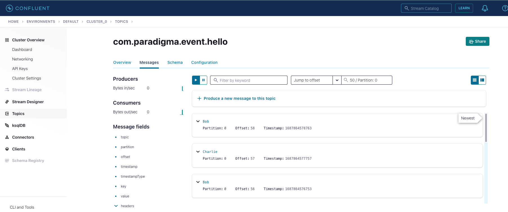

# Hello Kafka API

Example to ilustrate AsycAPI generator
From AsynApi spec i've created a springboot project

## Steps done

1- Create asyncapi spec
2- Install AsynApiGenerator
```shell
npm install -g @asyncapi/generator
```
2- Run generator
  I've customized package, use actuator and useServers
```shell
ag  -p javaPackage=com.paradigma.poc.asyncapi -p useServers=true -p actuator=true ./asyncapi.yaml 
```
3- Config confluent cloud server and topic [link](https://www.confluent.io/confluent-cloud/tryfree/)

4- Config security resource application
```yaml
spring:
  cloud:
    stream:
      kafka:
        binder:
          brokers: 'pkc-6ojv2.us-west4.gcp.confluent.cloud:9092'
          configuration.sasl.jaas.config: "org.apache.kafka.common.security.plain.PlainLoginModule required username='AMJ4GS6GS7FVZPTY' password='XXX';"
          configuration:
            sasl:
              mechanism: PLAIN
            security:
              protocol: SASL_SSL
```
5- Run generator
```shell
mvn clean install
```
6- Run app
```shell
mvn spring-boot:run
```

7- Check the console and the topic

